# Sudoku puzzle gallery

Diagrams are rendered from the corresponding JSON files. They show the starting clues, cage sums, and thermometer paths.
Variant fixtures are generated examples, not exact transcriptions of the linked source diagrams. Coordinates in JSON are zero-based.

## Classic Sudoku

### classic_01

Dataset record: `classic-000002`

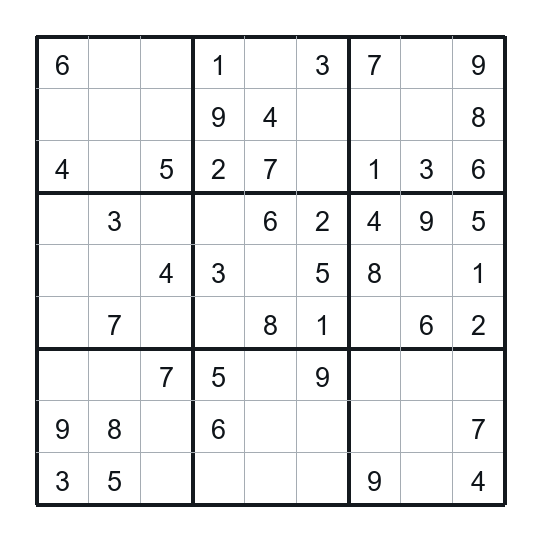

JSON: [`classic_01.json`](classic/classic_01.json)

### classic_02

Dataset record: `classic-000009`

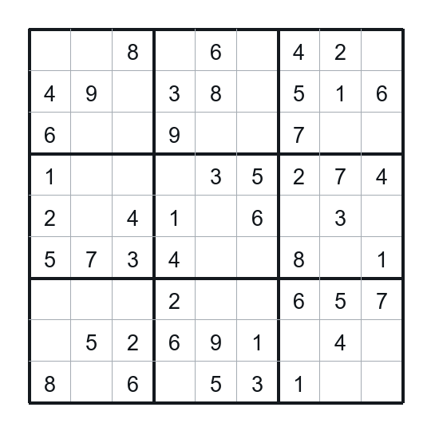

JSON: [`classic_02.json`](classic/classic_02.json)

### classic_03

Dataset record: `classic-000016`

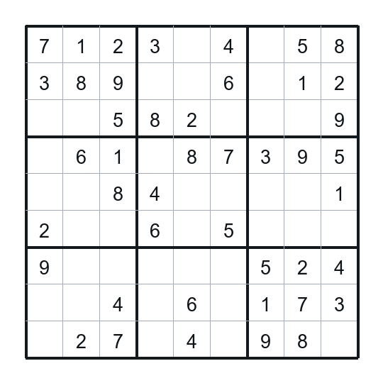

JSON: [`classic_03.json`](classic/classic_03.json)

### classic_04

Dataset record: `classic-000026`

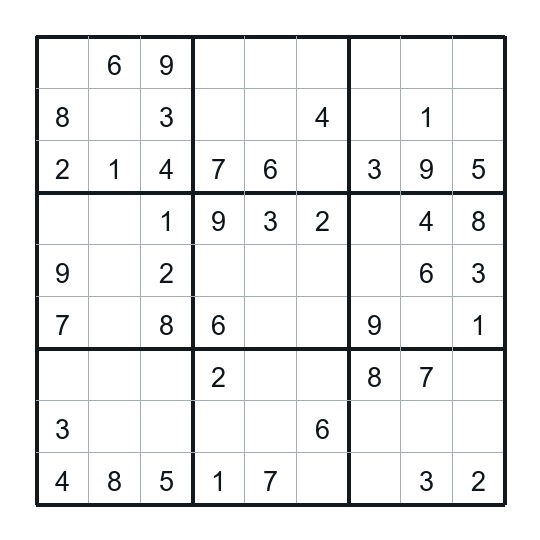

JSON: [`classic_04.json`](classic/classic_04.json)

### classic_05

Dataset record: `classic-000034`

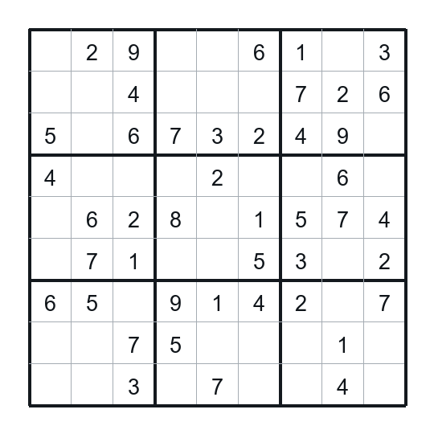

JSON: [`classic_05.json`](classic/classic_05.json)

## Killer Sudoku

### killer_01

Generated for this project with the recorded seed.

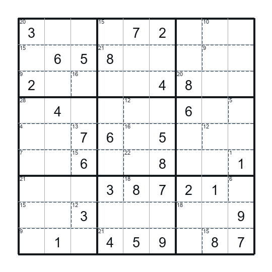

JSON: [`killer_01.json`](killer/killer_01.json)
Sources: [rules reference](https://www.gmpuzzles.com/blog/2022/11/killer-thermo-sudoku-by-michael-rios/)

### killer_02

Generated for this project with the recorded seed.

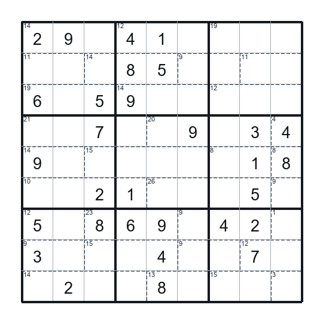

JSON: [`killer_02.json`](killer/killer_02.json)
Sources: [rules reference](https://www.gmpuzzles.com/blog/2022/11/killer-thermo-sudoku-by-michael-rios/)

### killer_03

Generated for this project with the recorded seed.

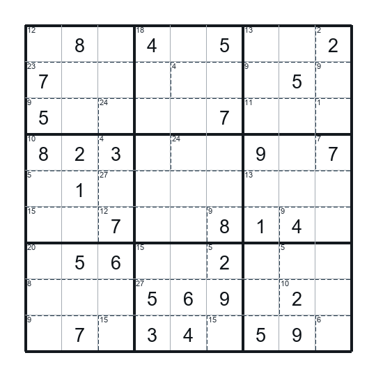

JSON: [`killer_03.json`](killer/killer_03.json)
Sources: [rules reference](https://www.gmpuzzles.com/blog/2022/11/killer-thermo-sudoku-by-michael-rios/)

### killer_04

Generated for this project with the recorded seed.

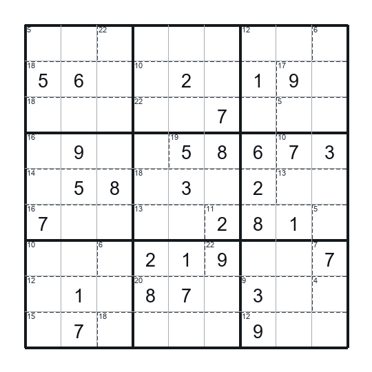

JSON: [`killer_04.json`](killer/killer_04.json)
Sources: [rules reference](https://www.gmpuzzles.com/blog/2022/11/killer-thermo-sudoku-by-michael-rios/)

### killer_05

Generated for this project with the recorded seed.

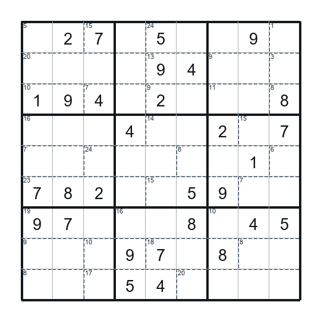

JSON: [`killer_05.json`](killer/killer_05.json)
Sources: [rules reference](https://www.gmpuzzles.com/blog/2022/11/killer-thermo-sudoku-by-michael-rios/)

## Thermo Sudoku

### thermo_01

Generated for this project with the recorded seed.

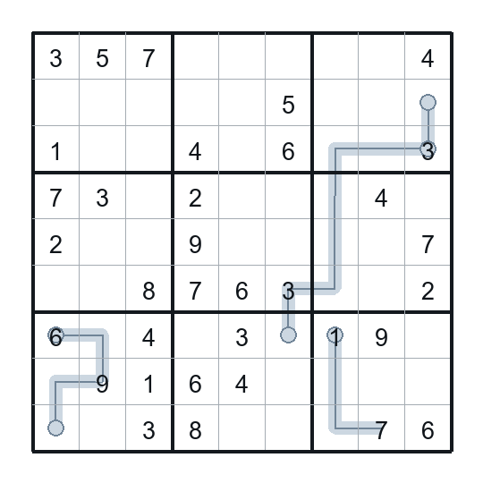

JSON: [`thermo_01.json`](thermo/thermo_01.json)
Sources: [rules reference](https://www.gmpuzzles.com/blog/2015/02/thermo-sudoku-ashish-kumar/)

### thermo_02

Generated for this project with the recorded seed.

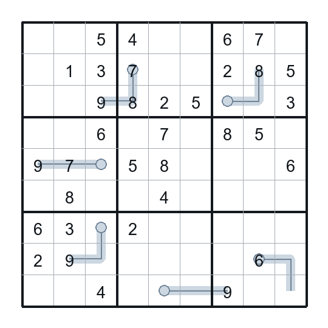

JSON: [`thermo_02.json`](thermo/thermo_02.json)
Sources: [rules reference](https://www.gmpuzzles.com/blog/2015/02/thermo-sudoku-ashish-kumar/)

### thermo_03

Generated for this project with the recorded seed.

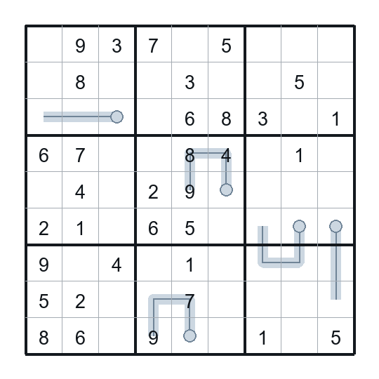

JSON: [`thermo_03.json`](thermo/thermo_03.json)
Sources: [rules reference](https://www.gmpuzzles.com/blog/2015/02/thermo-sudoku-ashish-kumar/)

### thermo_04

Generated for this project with the recorded seed.

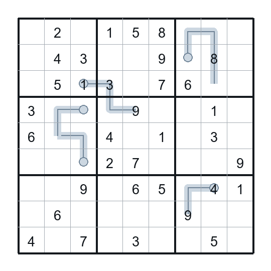

JSON: [`thermo_04.json`](thermo/thermo_04.json)
Sources: [rules reference](https://www.gmpuzzles.com/blog/2015/02/thermo-sudoku-ashish-kumar/)

### thermo_05

Generated for this project with the recorded seed.

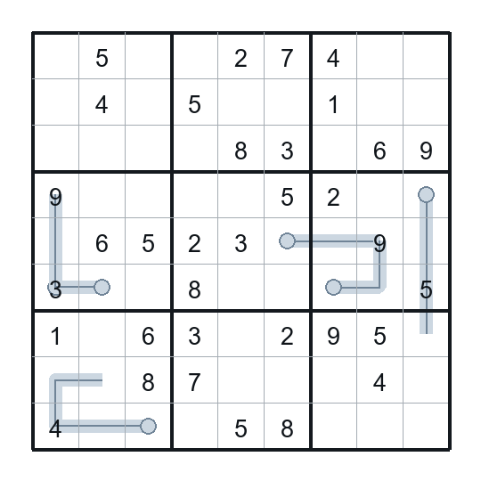

JSON: [`thermo_05.json`](thermo/thermo_05.json)
Sources: [rules reference](https://www.gmpuzzles.com/blog/2015/02/thermo-sudoku-ashish-kumar/)

## Killer + Thermo Sudoku

### killer_thermo_01

Generated for this project with the recorded seed.

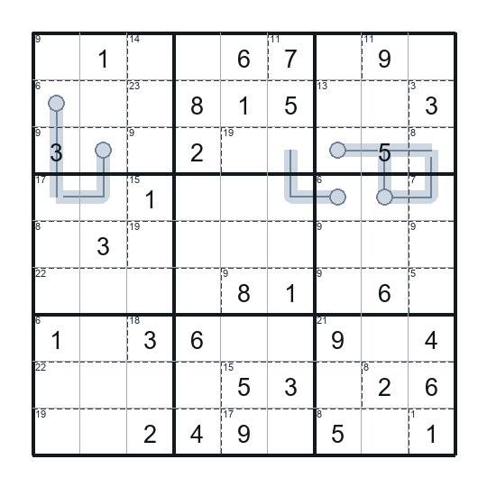

JSON: [`killer_thermo_01.json`](killer_thermo/killer_thermo_01.json)
Sources: [rules reference](https://www.gmpuzzles.com/blog/2022/11/killer-thermo-sudoku-by-michael-rios/), [rules reference](https://www.gmpuzzles.com/blog/2015/02/thermo-sudoku-ashish-kumar/)

### killer_thermo_02

Generated for this project with the recorded seed.

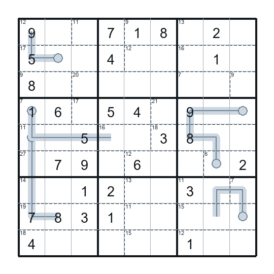

JSON: [`killer_thermo_02.json`](killer_thermo/killer_thermo_02.json)
Sources: [rules reference](https://www.gmpuzzles.com/blog/2022/11/killer-thermo-sudoku-by-michael-rios/), [rules reference](https://www.gmpuzzles.com/blog/2015/02/thermo-sudoku-ashish-kumar/)

### killer_thermo_03

Generated for this project with the recorded seed.

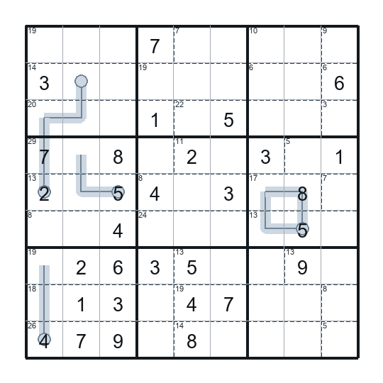

JSON: [`killer_thermo_03.json`](killer_thermo/killer_thermo_03.json)
Sources: [rules reference](https://www.gmpuzzles.com/blog/2022/11/killer-thermo-sudoku-by-michael-rios/), [rules reference](https://www.gmpuzzles.com/blog/2015/02/thermo-sudoku-ashish-kumar/)

### killer_thermo_04

Generated for this project with the recorded seed.

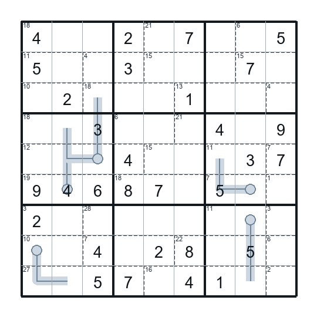

JSON: [`killer_thermo_04.json`](killer_thermo/killer_thermo_04.json)
Sources: [rules reference](https://www.gmpuzzles.com/blog/2022/11/killer-thermo-sudoku-by-michael-rios/), [rules reference](https://www.gmpuzzles.com/blog/2015/02/thermo-sudoku-ashish-kumar/)

### killer_thermo_05

Generated for this project with the recorded seed.

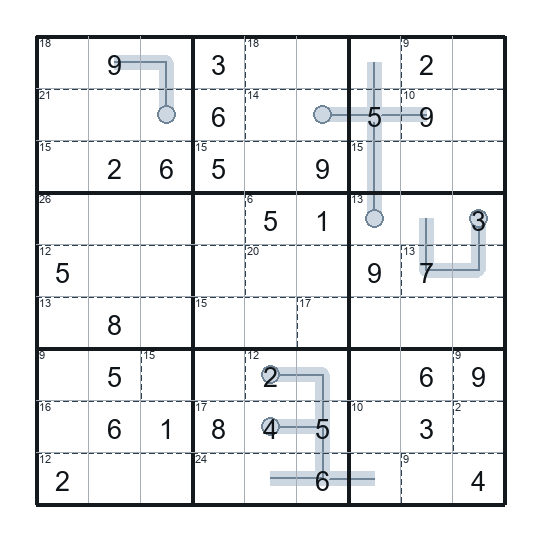

JSON: [`killer_thermo_05.json`](killer_thermo/killer_thermo_05.json)
Sources: [rules reference](https://www.gmpuzzles.com/blog/2022/11/killer-thermo-sudoku-by-michael-rios/), [rules reference](https://www.gmpuzzles.com/blog/2015/02/thermo-sudoku-ashish-kumar/)

