# Sudoku solution gallery

Each board is rendered from the `known_solution` field in its JSON file. Variant constraint markings are retained for reference.

## Classic Sudoku

### classic_01 solution

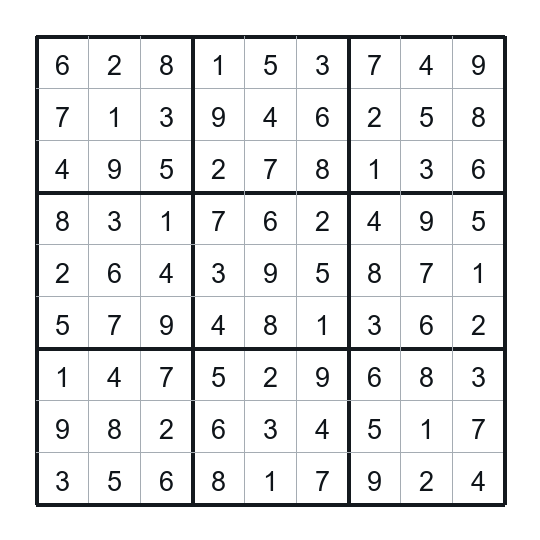

Puzzle JSON: [`classic_01.json`](classic/classic_01.json)

### classic_02 solution

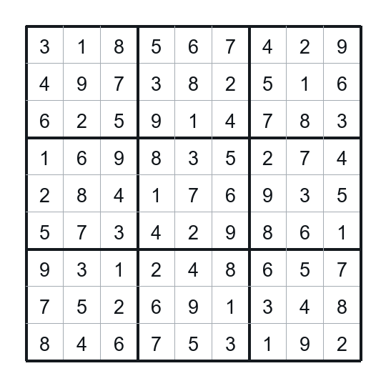

Puzzle JSON: [`classic_02.json`](classic/classic_02.json)

### classic_03 solution

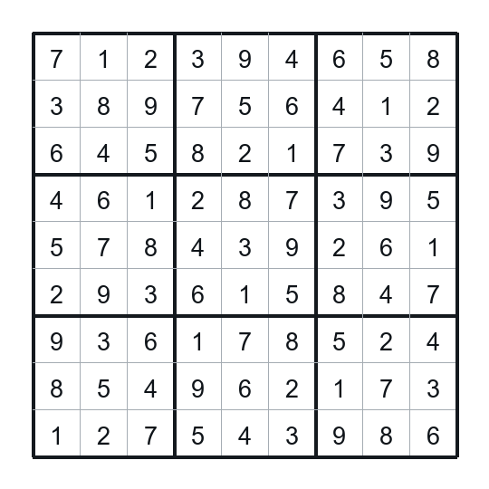

Puzzle JSON: [`classic_03.json`](classic/classic_03.json)

### classic_04 solution

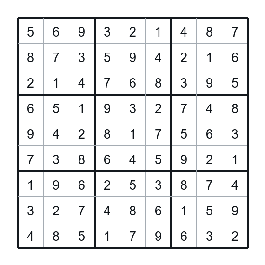

Puzzle JSON: [`classic_04.json`](classic/classic_04.json)

### classic_05 solution

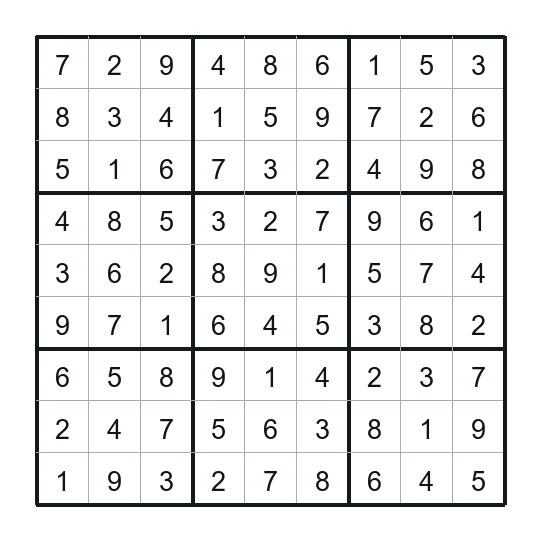

Puzzle JSON: [`classic_05.json`](classic/classic_05.json)

## Killer Sudoku

### killer_01 solution

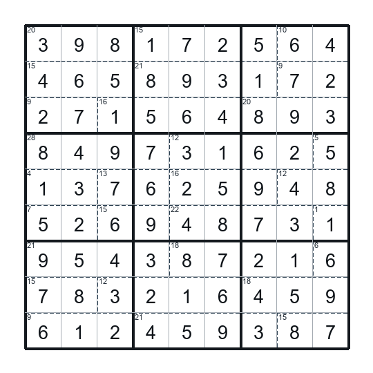

Puzzle JSON: [`killer_01.json`](killer/killer_01.json)

### killer_02 solution

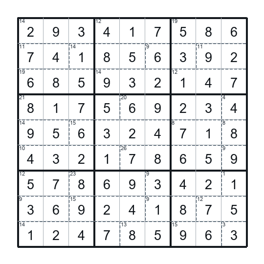

Puzzle JSON: [`killer_02.json`](killer/killer_02.json)

### killer_03 solution

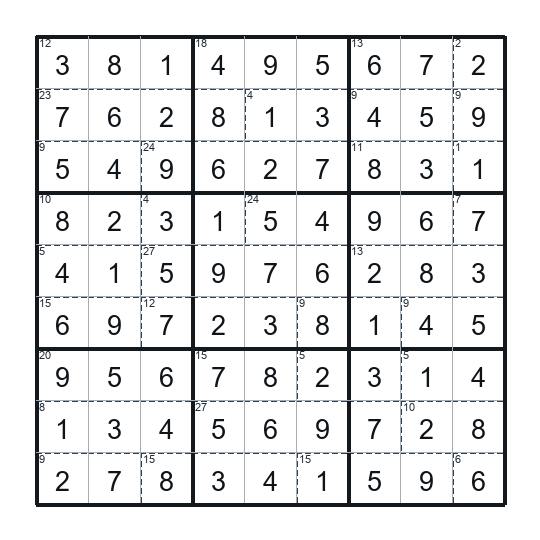

Puzzle JSON: [`killer_03.json`](killer/killer_03.json)

### killer_04 solution

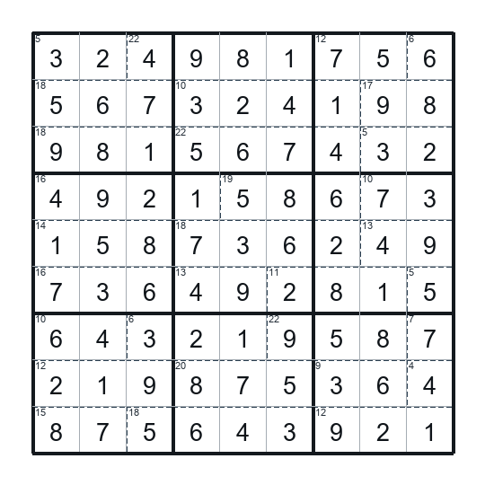

Puzzle JSON: [`killer_04.json`](killer/killer_04.json)

### killer_05 solution

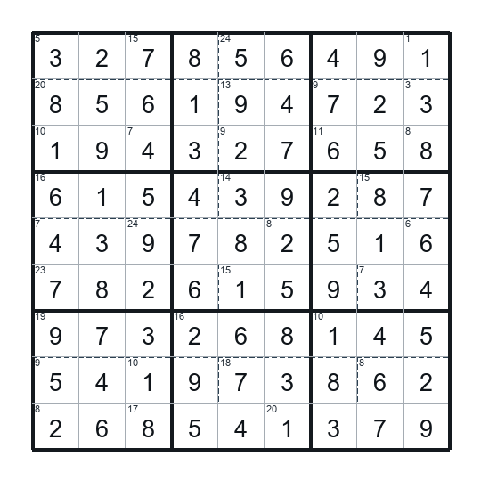

Puzzle JSON: [`killer_05.json`](killer/killer_05.json)

## Thermo Sudoku

### thermo_01 solution

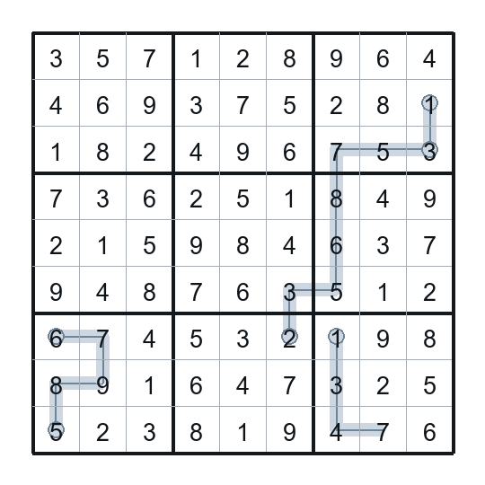

Puzzle JSON: [`thermo_01.json`](thermo/thermo_01.json)

### thermo_02 solution

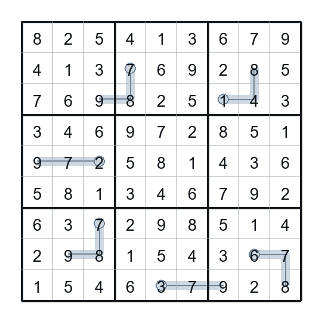

Puzzle JSON: [`thermo_02.json`](thermo/thermo_02.json)

### thermo_03 solution

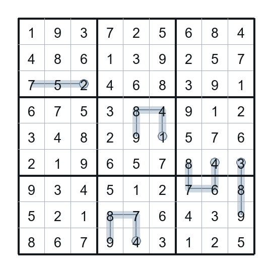

Puzzle JSON: [`thermo_03.json`](thermo/thermo_03.json)

### thermo_04 solution

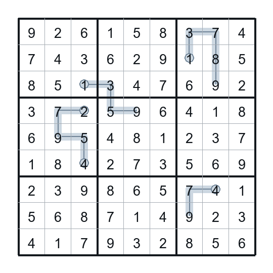

Puzzle JSON: [`thermo_04.json`](thermo/thermo_04.json)

### thermo_05 solution

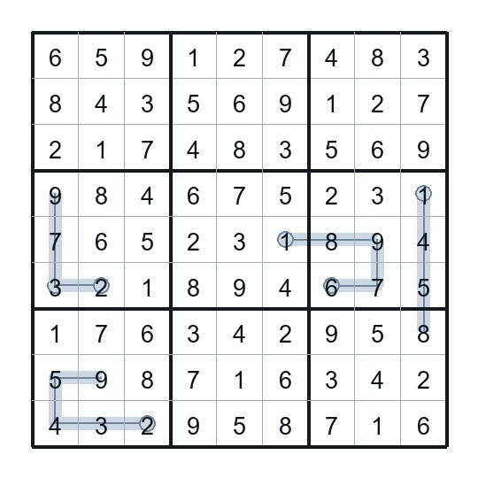

Puzzle JSON: [`thermo_05.json`](thermo/thermo_05.json)

## Killer + Thermo Sudoku

### killer_thermo_01 solution

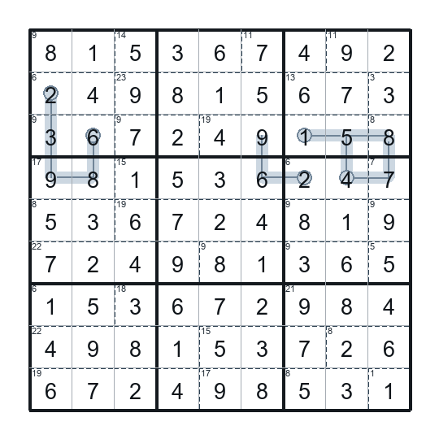

Puzzle JSON: [`killer_thermo_01.json`](killer_thermo/killer_thermo_01.json)

### killer_thermo_02 solution

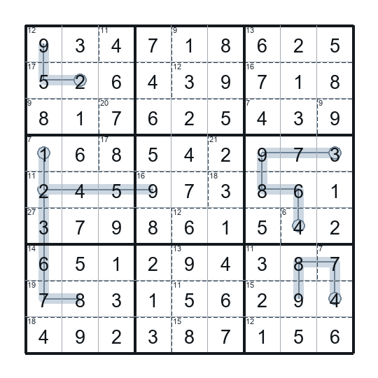

Puzzle JSON: [`killer_thermo_02.json`](killer_thermo/killer_thermo_02.json)

### killer_thermo_03 solution

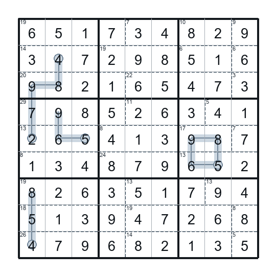

Puzzle JSON: [`killer_thermo_03.json`](killer_thermo/killer_thermo_03.json)

### killer_thermo_04 solution

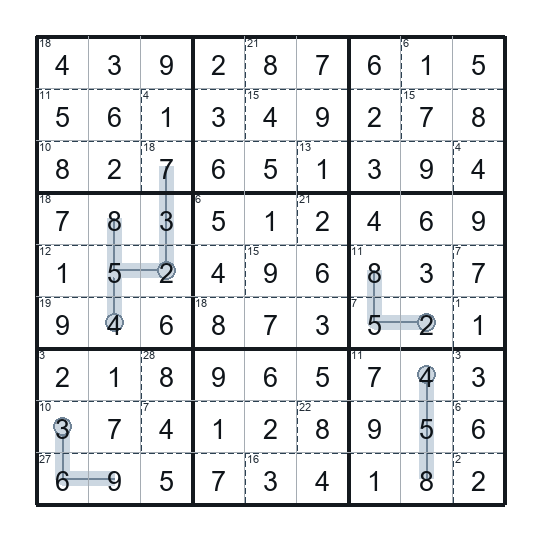

Puzzle JSON: [`killer_thermo_04.json`](killer_thermo/killer_thermo_04.json)

### killer_thermo_05 solution

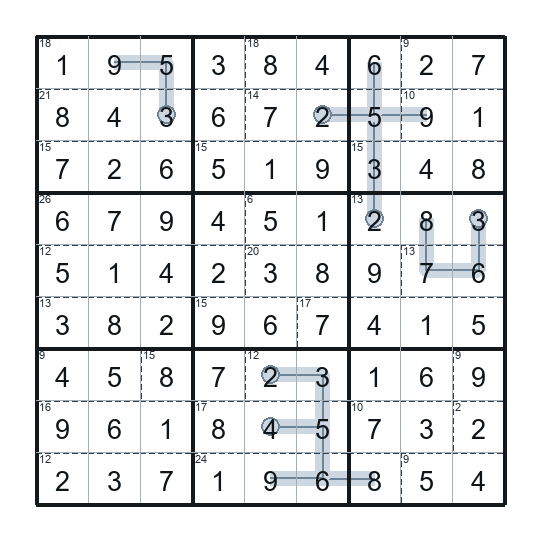

Puzzle JSON: [`killer_thermo_05.json`](killer_thermo/killer_thermo_05.json)
